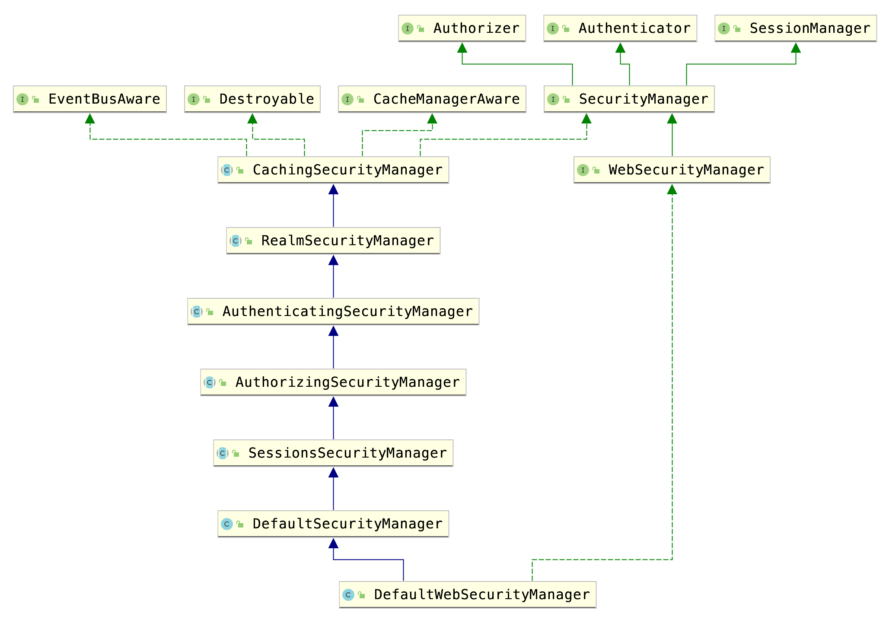
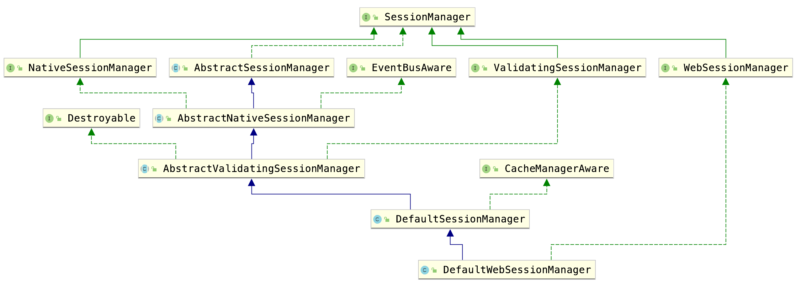
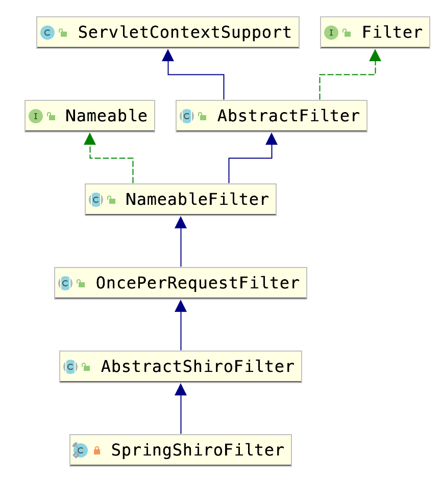

# Shiro中的Session管理

Shiro中Session有两个来源：

1. 获取Servlet容器（如tomcat）的session。
2. 使用自己的Session管理机制。


当我们在非web环境下（是的，Shiro可以在非web环境下身份验证），肯定是第二种。

在web环境下的话，就看SessionManager的具体类型了。


我们常用的安全管理器是`DefaultWebSecurityManager`.继承结构如下。




在它的父类SessionsSecurityManager中包含sessionManager属性。默认是DefaultSessionManager。

通过设置为DefaultWebSessionManager可以把session让shiro来控制。





具体分析如下：

我们都知道shiro通过filter来拦截更改请求。

filter的继承关系如下图：



`OncePerRequestFilter`会调用doFilter方法，这个方法会调用doFilterInternal。

`AbstractShiroFilter`子类实现了doFilterInternal这个方法。这个方法继续调用doFilterInternal ->prepareServletRequest -> wrapServletRequest。 wrapServletRequest这个方法，会根据域中securityManager的isHttpSessionMode方法来判断是否采用servlet容器的session。（true：使用servlet容器的session，false：采用自定义session）。

```java
public abstract class AbstractShiroFilter extends OncePerRequestFilter {
	protected ServletRequest wrapServletRequest(HttpServletRequest orig) {
        return new ShiroHttpServletRequest(orig, getServletContext(), isHttpSessions());
    }
    //......
}
```

```java
public class ShiroHttpServletRequest extends HttpServletRequestWrapper {
public HttpSession getSession(boolean create) {

        HttpSession httpSession;

        if (isHttpSessions()) {
            httpSession = super.getSession(false);
            if (httpSession == null && create) {
                //Shiro 1.2: assert that creation is enabled (SHIRO-266):
                if (WebUtils._isSessionCreationEnabled(this)) {
                    httpSession = super.getSession(create);
                } else {
                    throw newNoSessionCreationException();
                }
            }
        } else {
            boolean existing = getSubject().getSession(false) != null;
            
            if (this.session == null || !existing) {
                Session shiroSession = getSubject().getSession(create);
                if (shiroSession != null) {
                    this.session = new ShiroHttpSession(shiroSession, this, this.servletContext);
                    if (!existing) {
                        setAttribute(REFERENCED_SESSION_IS_NEW, Boolean.TRUE);
                    }
                } else if (this.session != null) {
                    this.session = null;
                }
            }
            httpSession = this.session;
        }

        return httpSession;
    }
    //......
}
```

可以看出，如果isHttpSessionMode结果为真，那么ShiroHttpServletRequest在getSession时会调用父类（HttpServletRequest）的结果，也就是servlet容器的结果。

但如果为假，则会`new ShiroHttpSession`来创建shiro自定义的session。


那么isHttpSessionMode的结果是怎么来的呢？

实现了这个方法的类是DefaultWebSessionManager，它的isHttpSessionMode方法中，会判断它类中的字段sessionManager。如果sessionManager是WebSessionManager的子类，同时它的isServletContainerSessions方法返回真，那么整个方法就返回真。

```java
public class DefaultWebSecurityManager extends DefaultSecurityManager implements WebSecurityManager {
    public boolean isHttpSessionMode() {
        SessionManager sessionManager = getSessionManager();
        return sessionManager instanceof WebSessionManager && ((WebSessionManager)sessionManager).isServletContainerSessions();
    }
    public SessionManager getSessionManager() {
        return this.sessionManager;
    }
    //.....
}
```

（还是挺绕的）


相关文章：

- https://www.cnblogs.com/yoohot/p/6085830.html

- https://www.cnblogs.com/youzhibing/p/9970405.html


