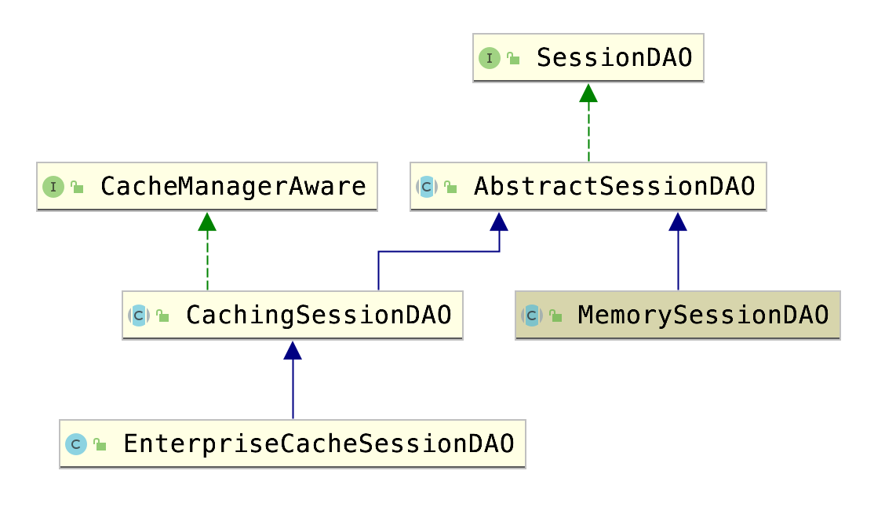

# Shiro实现使用redis存储session

## 分析结构

首先分析结构。

我们默认使用的安全管理器是`DefaultWebSessionManager`，它继承自`DefaultSessionManager`，`DefaultSessionManager`有个sessionDAO的字段，这个对象负责存储session。它默认的值是MemorySessionDAO的一个实例，也就是在内存中存储，其实现是一个`ConcurrentMap`。

sessionDAO的继承结构如下图：

查看每个类/接口的方法，可以看出：

- SessionDAO接口提出了基本的CRUD功能。

- AbstractSessionDAO抽象类封装了create和readSession，并让子类去实现doCreate和doReadSesssion。它还要求实现一个SessionIdGenerator，用来根据session生成一个id，可以用于传递给浏览器作为cookie，默认实现是一个对`UUID.randomUUID`进行简单封装的类。

- CachingSessionDAO抽象类进一步封装了update和delete，让子类去实现doUpdate和doDelete。同时提供了一个缓存机制，这要求我们设置一个缓存管理器。

- 在EnterpriseCacheSessionDAO中，基本上只是设置了一个缓存管理器`MapCache`（它是对`ConcurrentMap`的简单封装）。

我们如果使用redis做session存储的话，显然应该每次都从redis去获取数据，而不能再加缓存了。所以我们可以直接继承SessionDAO接口，实现对session的CRUD。

