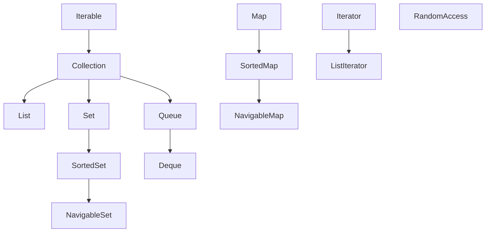

# Java中的集合

集合是一个接口`Collection`。

```java
public interface Collection<E> extends Iterable<E>
```

具体来说：




Sorted代表集合中的元素是有序的，可以对元素的Key进行排序。

而Navigable的接口说明具有了为给定搜索目标报告最接近匹配项的导航方法。


## List

List是一个接口，简单说就是一个动态数组。

常见的实现类有：

- `ArrayList`，底层实现是数组，所以插入和删除较慢，遍历很快，随机访问很快。
- `LinkedList`，底层实现是链表，所以插入和删除很慢，遍历快，随机访问很慢。
- ~~`Vector`~~， 对每个操作线程安全，**不推荐使用**。因为一般我们需要一些操作线程安全才行。需要时推荐使用前两个类，然后自行加锁。


## Map

`Map`是一个接口，也就是常见的键值对。

具体的实现类有：

- `HashMap` 常用，非线程安全，键值对较少时使用拉链法（数组+链表），较多时使用红黑树。
- ~~`Hashtable`~~  线程安全，始终使用拉链法（数组+链表）。不推荐使用（因为它需要锁定整个表），如果不需要线程安全，请使用`HashMap`，如果需要线程安全，推荐使用`concurrent.ConcurrentHashMap`

- `concurrent.ConcurrentHashMap`，线程安全版的`HashMap`。

- `TreeMap`，底层使用红黑树实现。基于NavigableMap接口实现，可以找到最接近的Key。非线程安全。


## Set

- HashSet
- TreeSet

