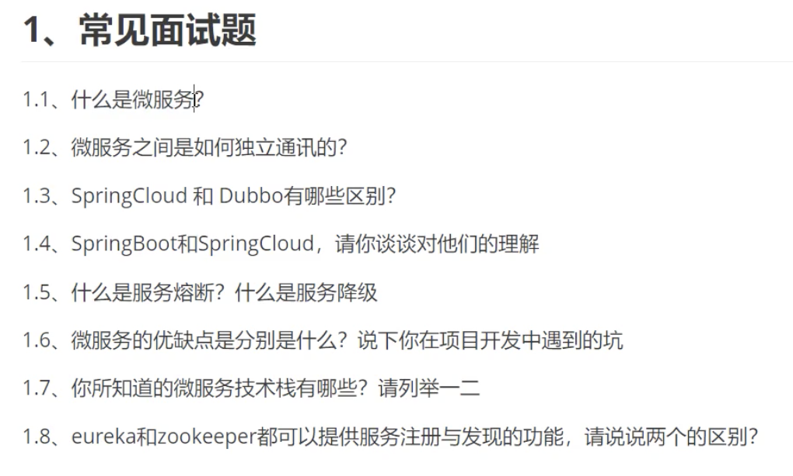

# SpringCloud 微服务

微服务的问题：

1. 如何做负载均衡？（API网关）
2. 服务之间如何通讯？（http、rpc）
3. 如何治理？（服务注册与发现，高可用）
4. 服务挂了怎么办？（熔断）

出现问题的本质在于网络不可靠。

SpringCloud是一个生态，它是为了解决上面的问题。它基于Springboot

解决方案：

1. spring cloud netflix  一站式方案

    > api 网关，zuul组件
    Feign ---http通信，同步阻塞
    Eureka（服务注册发现）
    熔断机制（Hystrix)
    ……

2. Apache dubbo + Zookeeper  半自动，需要整合别人的

    > 没有API网关，用第三方或者自己实现
    > Dubbo是rpc通信，
    > Zookeeper服务注册与发现
    > 没有熔断，借助Hystrix（停止更新，但还在维护）

3. SpringClound Alibaba 一站式方案。更简单。

    

