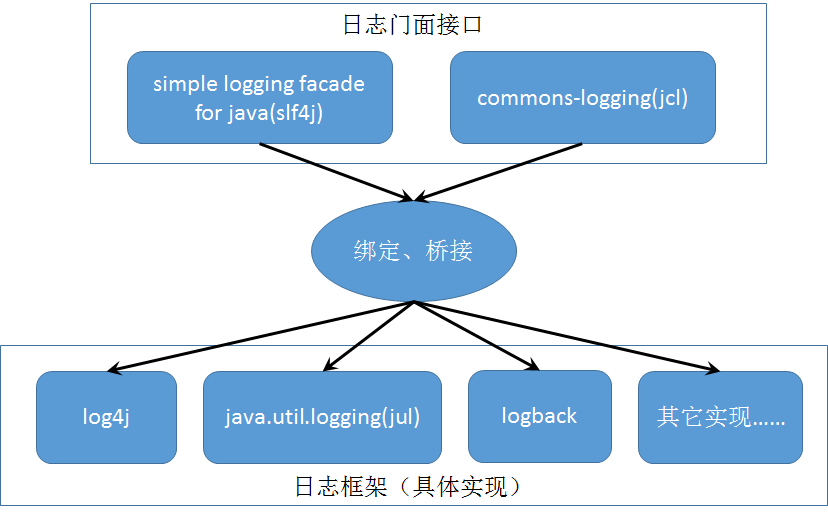

# 日志系统

日志一开始只是一些单纯的库，

- java.util.logging（JDK自带）
- log4j
- log4j2
- logback

但是也有一些想法是抽象一个Log相关的接口出来，这样就有日志门面：

- commons-logging
- Slf4j

局面大概是这样：

这样为了统一，就有一些适配器用来转换。

### slf4j 门面 到 具体实现

- slf4j-log4j12  用Slf4j的API，底层是log4j实现。

- logback-classic 用Slf4j的API，底层是logback实现。

- log4j-slf4j-impl 使用Slf4j的接口，底层是log4j2来实现。

### 其他实现重定向到slf4j门面

- log4j-over-slf4j 使用log4j的接口，代理到slf4j去实现，但最底层是什么，取决于slf4j的配置。当我们的工程是用slf4j，但引入的包却使用log4j时可以用这个包重定向它的日志。
- jul-to-slf4j 把java.util.logging重定向到slf4j

**注意**：重定向循环的话，就会因为循环调用而栈溢出！==转调回slf4j的日志框架不能跟slf4j当前桥接到的日志框架相同。==

