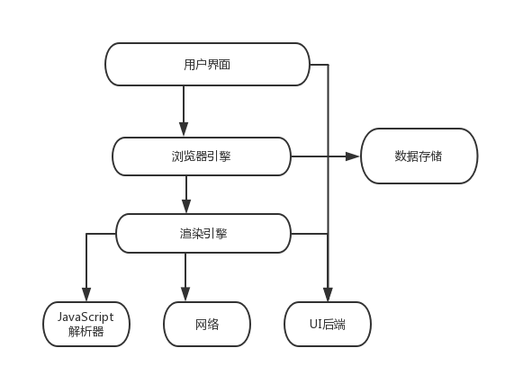
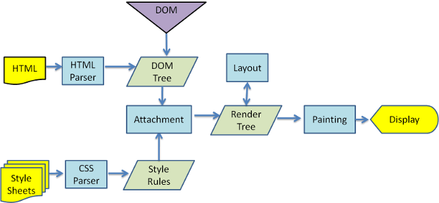
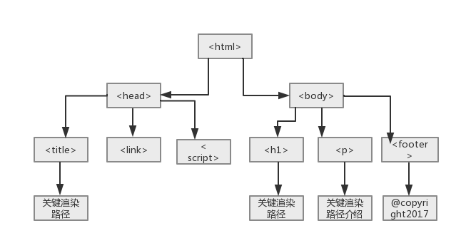
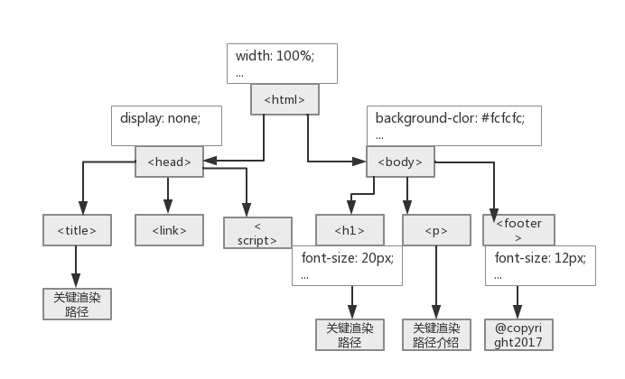
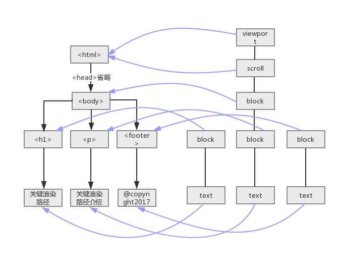
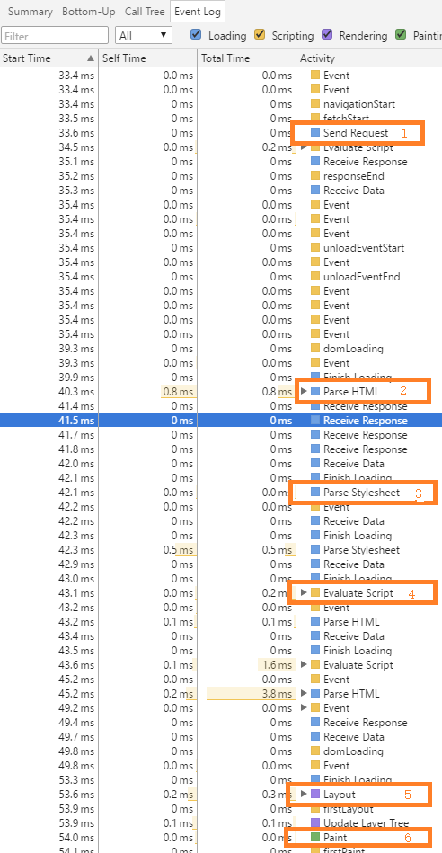

# 浅析前端页面渲染机制[转]

[TOC]

## 前言
作为一个前端开发，最常见的运行环境应该是浏览器吧，为了更好的通过浏览器把优秀的产品带给用户，也为了更好的发展自己的前端职业之路，有必要了解从我们在浏览器地址栏输入网址到看到页面这期间浏览器是如何进行工作的,进而了解如何更好的优化实践，本篇主要围绕这两点展开阐述。前端页面渲染机制可谓是老生常谈，但又很有必要再谈的话题，于是还是决定写一篇，即是对知识的回顾总结，又能与大家分享，何乐而不为。网上相关类型的文章也很多，有兴趣的可以多学习一下。

## 浏览器

在介绍浏览器工作流程之前，先了解一下主流浏览器的基础结构，本文所介绍的浏览器主要为开源的Chrome，FireFox及部分开源的Safari，这也是目前市场占比最高的几大浏览器。


### 浏览器基础结构

浏览器基础结构主要包括如下7部分：

1. 用户界面（User Interface）:用户所看到及与之交互的功能组件，如地址栏，返回，前进按钮等；
2. 浏览器引擎（Browser engine）:负责控制和管理下一级的渲染引擎；    
3. 渲染引擎（Rendering engine）:负责解析用户请求的内容（如HTML或XML，渲染引擎会解析HTML或XML，以及相关CSS，然后返回解析后的内容）；
4. 网络（Networking）:负责处理网络相关的事务，如HTTP请求等；
5. UI后端（UI backend）:负责绘制提示框等浏览器组件，其底层使用的是操作系统的用户接口；
6. JavaScript解释器（JavaScript interpreter）:负责解析和执行JavaScript代码；
7. 数据存储（Data storage）:负责持久存储诸如cookie和缓存等应用数据。



### 浏览器内核

各大主要浏览器使用内核也是有差别的，大致可以分为以下几类：

    Trident内核：IE
    Webkit内核：Chrome,Safari
    Gecko内核：FireFox

## 网络

当用户访问页面时，浏览器需要获取用户请求内容，这个过程主要涉及浏览器网络模块：

    1.用户在地址栏输入域名，如baidu.com，DNS（Domain Name System，域名解析系统）服务器根据输入的域名查找对应IP，然后向该IP地址发起请求；


    2.浏览器获得并解析服务器的返回内容(HTTP response)；
    3.浏览器加载HTML文件及文件内包含的外部引用文件及图片，多媒体等资源。

### DNS预解析（DNS prefetch）

浏览器DNS解析大多时候较快，且会缓存常用域名的解析值，但是如果网站涉及多域名，在对每一个域名访问时都需要先解析出IP地址，而我们希望在跳转或者请求其他域名资源时尽量快，则可以开启域名预解析，浏览器会在空闲时提前解析声明需要预解析的域名，如：


### 多线程

我们通常说JavaScript执行是单线程的，但是浏览器网络部分通常是有几个平行线程同时开启，但是也会有
限制，一般为2-6个。
## 渲染引擎及关键渲染路径（Critical Rendering Path）

渲染引擎所做的事是将请求内容展现给我们，默认支持HTML,XML和图片类型，对于其他诸如PDF等类型的内容则需要安装相应插件，但浏览器的展示工作流程基本是一样的。

通过网络模块加载到HTML文件后渲染引擎渲染流程如下，这也通常被称作关键渲染路径（Critical Rendering Path）：

1. 构建DOM树(DOM tree)：从上到下解析HTML文档生成DOM节点树（DOM tree），也叫内容树（content tree）；  
2. 构建CSSOM(CSS Object Model)树：加载解析样式生成CSSOM树；
3. 执行JavaScript：加载并执行JavaScript代码（包括内联代码或外联JavaScript文件）；
4. 构建渲染树(render tree)：根据DOM树和CSSOM树,生成渲染树(render tree)；
渲染树：按顺序展示在屏幕上的一系列矩形，这些矩形带有字体，颜色和尺寸等视觉属性。
5. 布局（layout）：根据渲染树将节点树的每一个节点布局在屏幕上的正确位置；
6. 绘制（painting）：遍历渲染树绘制所有节点，为每一个节点适用对应的样式，这一过程是通过UI后端模块完成；

 

为了更友好的用户体验，浏览器会尽可能快的展现内容，而不会等到文档所有内容到达才开始解析和构建/布局渲染树，而是每次处理一部分，并展现在屏幕上，这也是为什么我们经常可以看到页面加载的时候内容是从上到下一点一点展现的。
### 流程图

Webkit渲染引擎流程如下图：


Gecko渲染引擎流程如下图：


如上图，Webkit浏览器和Gecko浏览器渲染流程大致相同,不同的是：

    1.Webkit浏览器中的渲染树(render tree)，在Gecko浏览器中对应的则是框架树（frame tree）,渲染对象(render object)对应的是框架（frame）;
    2.Webkit中的布局（Layout）过程，在Gecko中称为回流（Reflow）,本质是一样的，后文会解释回流的另一层含义–重新布局；
    3.Gecko中HTML和DOM树中间多了一层内容池（Content sink）,可以理解成生成DOM元素的工厂。

### 单线程

不同于网络部分的多线程渲染引擎是单线程工作的，意味着渲染流程是一步一步渐进完成的。
###解析文档(parser HTML)

在详细介绍浏览器渲染文档之前，先应该理解浏览器如何解析文档：解析文档的顺序，对于CSS和JavaScript如何处理等。
#### 解析顺序

浏览器按从上到下的顺序扫描解析文档；
#### 解析样式和脚本

**脚本**

或许是由于通常会在JavaScript脚本中改变文档DOM结构，于是浏览器以同步方式解析，加载和执行脚本，浏览器在解析文档时，当解析到`<script>`标签时，会解析其中的脚本（对于外链的JavaScript文件，需要先加载该文件内容，再进行解析），然后立即执行，这整个过程都会阻塞文档解析，直到脚本执行完才会继续解析文档。就是说由于脚本是同步加载和执行的，它会阻塞文档解析，这也解释了为什么现在通常建议将`<script>`标签放在`</body>`标签前面，而不是放在`<head>`标签里。现在HTML5提供defer和async两个属性支持延迟和异步加载JavaScript文件，如：
```javascript
<script defer src="script.js">
```
**改进**

针对上文说的脚本阻塞文档解析，主流浏览器如Chrome和FireFox等都有一些优化，比如在执行脚本时，开启另一个线程解析剩余的文档以找出并加载其他的待下载外部资源（不改变主线程的DOM树，仅优化加载外部资源）。

**样式**
不同于脚本，浏览器对样式的处理并不会阻塞文档解析，大概是因为样式表并不会改变DOM结构。

**样式表与脚本**

你可能想问样式是否会阻塞脚本文件的加载执行呢？正常情况是不会的，但是存在一个问题是通常我们会在脚本中请求样式信息，但是在文档解析时，如果样式尚未加载或解析，将会得到错误信息，对于这一问题，FireFox浏览器和Webkit浏览器处理策略不同：

- 当存在有样式文件未被加载和解析时，FireFox浏览器会阻塞所有脚本；
- 而Webkit浏览器只会阻塞操作了改文件内声明的样式属性的脚本。

### 构建DOM树

DOM，即文档对象模型（Document Object Model）,DOM树，即文档内所有节点构成的一个树形结构。

假设浏览器获取返回的如下HTML文档：
```html
<!doctype html> <html> <head> 
<link rel="stylesheet" href="./theme.css"></link> 
<script src="./config.js"></script> 
<title>关键渲染路径</title> 
</head> <body> 
<h1 class="title">关键渲染路径</h1> <p>关键渲染路径介绍</p>
<footer>@copyright2017</footer> 
</body> </html>   
```

首先浏览器从上到下依次解析文档构建DOM树，如下：



### 构建CSSOM树

CSSOM，即CSS对象模型（CSS Object Model），CSSOM树，与DOM树结构相似，只是另外为每一个节点关联了样式信息。

theme.css样式内容如下：
```css
html, body { 
    width: 100%; height: 100%; background-color: #fcfcfc; } 
.title { 
    font-size: 20px; } 
.footer { 
    font-size: 12px; color: #aaa; }  
```
 构建CSSOM树如图： 



### 执行JavaScript

上文已经阐述了文档解析时对脚本的处理，我们得知脚本加载，解析和执行会阻塞文档解析，而在特殊情况下样式的加载和解析也会阻塞脚本，所以现在推荐的实践是`<script>`标签放在`</body>`标签前面。

### 构建渲染树(render tree)

DOM树和CSSOM树都构建完了，接着浏览器会构建渲染树：

>渲染树，代表一个文档的视觉展示，浏览器通过它将文档内容绘制在浏览器窗口，展示给用户，它由按顺序展示在屏幕上的一系列矩形对象组成，这些矩形对象都带有字体，颜色和尺寸，位置等视觉样式属性。对于这些矩对象，FireFox称之为框架（frame）,Webkit浏览器称之为渲染对象（render object, renderer），后文统称为渲染对象。

**这里把渲染树节点称为矩形对象，是因为，每一个渲染对象都代表着其对应DOM节点的CSS盒子,该盒子包含了尺寸，位置等几何信息，同时它指向一个样式对象包含其他视觉样式信息。**

#### 渲染树与DOM树

每一个渲染对象都对应着DOM节点，但是非视觉（隐藏，不占位）DOM元素不会插入渲染树，如<head>元素或声明display: none;的元素，渲染对象与DOM节点不是简单的一对一的关系，一个DOM可以对应一个渲染对象，但一个DOM元素也可能对应多个渲染对象，因为有很多元素不止包含一个CSS盒子，如当文本被折行时，会产生多个行盒，这些行会生成多个渲染对象；又如行内元素同时包含块元素和行内元素，则会创建一个匿名块级盒包含内部行内元素，此时一个DOM对应多个矩形对象（渲染对象）。

渲染树及其对应DOM树如图：



图中渲染树viewport即视口，是文档的初始包含块，scroll代表滚动区域，详见CSS之视觉格式化模型(Visual Formatting Model)
渲染树并不会包含显式或隐式地display：none;的标签元素。

### 布局（Layout）或回流（reflow，relayout）

创建渲染树后，下一步就是布局（Layout）,或者叫回流（reflow,relayout），这个过程就是通过渲染树中渲染对象的信息，计算出每一个渲染对象的位置和尺寸，将其安置在浏览器窗口的正确位置，而有些时候我们会在文档布局完成后对DOM进行修改，这时候可能需要重新进行布局，也可称其为回流，本质上还是一个布局的过程，每一个渲染对象都有一个布局或者回流方法，实现其布局或回流。
#### 流（flow）

HTML采用的是基于流的方式定位布局，其按照从左到右，从上到下的顺序进行排列，详见CSS定位机制。
####全局布局与局部布局

对渲染树的布局可以分为全局和局部的，全局即对整个渲染树进行重新布局，如当我们改变了窗口尺寸或方向或者是修改了根元素的尺寸或者字体大小等；而局部布局可以是对渲染树的某部分或某一个渲染对象进行重新布局。
#### 脏位系统（dirty bit system）

大多数web应用对DOM的操作都是比较频繁，这意味着经常需要对DOM进行布局和回流，而如果仅仅是一些小改变，就触发整个渲染树的回流，这显然是不好的，为了避免这种情况，浏览器使用了脏位系统，只有一个渲染对象改变了或者某渲染对象及其子渲染对象脏位值为”dirty”时，说明需要回流。

表示需要布局的脏位值有两种：

    “dirty”–自身改变，需要回流
    “children are dirty”–子节点改变，需要回流

#### 布局过程

布局是一个从上到下，从外到内进行的递归过程，从根渲染对象，即对应着HTML文档根元素<html>，然后下一级渲染对象，如对应着<body>元素，如此层层递归，依次计算每一个渲染对象的几何信息（位置和尺寸）。

几何信息-位置和尺寸，即相对于窗口的坐标和尺寸，如根渲染对象，其坐标为（0， 0），尺寸即是视口
尺寸（浏览器窗口的可视区域）。

每一个渲染对象的布局流程基本如：

- 1.计算此渲染对象的宽度（width）；
- 2.遍历此渲染对象的所有子级，依次：
    - 2.1设置子级渲染对象的坐标
    - 2.2判断是否需要触发子渲染对象的布局或回流方法，计算子渲染对象的高度（height）
- 3.设置此渲染对象的高度：根据子渲染对象的累积高，margin和padding的高度设置其高度；
- 4.设置此渲染对象脏位值为false。

#### 强制回流

在渲染树布局完成后，再次操作文档，改变文档的内容或结构，或者元素定位时，会触发回流，即需要重新布局，如请求某DOM的”offsetHeight”样式信息等诸多情况：

    DOM操作，如增加，删除，修改或移动；
    变更内容；
    激活伪类；
    访问或改变某些CSS属性（包括修改样式表或元素类名或使用JavaScript操作等方式）；
    浏览器窗口变化（滚动或尺寸变化）

```css
$('body').css('padding'); // reflow    
$('body')[0].offsetHeight; // relow   
```
有过CSS3动画开发经验的同学可能会有经历，如下入场动画：
```css
.slide-left
{
-webkit-transition: margin-left 1s ease-out;
-moz-transition: margin-left 1s ease-out;
-o-transition: margin-left 1s ease-out;
transition: margin-left 1s ease-out;
} 
```
然后执行如下脚本：

```javascript
var $slide = $('.slide-left');
$slide.css({
"margin-left": "100px"}).addClass('slide-left');
$slide.css({
"margin-left": "10px"});
```
我们会发现并没有效果，为什么呢？因为对margin-left的修改并没有触发回流，元素margin-left值的改变被缓存，如果我们在中间强制触发回流：
```javascript
var $slide = $('.slide-left');
$slide.css({
"margin-left": "100px"});
console.log($slide.css('padding');
$slide.addClass('slide-left');
$slide.css({"margin-left": "10px"}); 
```
 
再看就达到了预期效果。
### 绘制（painting）

最后是绘制(paint)阶段或重绘（repaint）阶段，浏览器UI组件将遍历渲染树并调用渲染对象的绘制（paint）方法，将内容展现在屏幕上，也有可能在之后对DOM进行修改，需要重新绘制渲染对象，也就是重绘，绘制和重绘的关系可以参考布局和回流的关系。
#### 全局与局部绘制

与布局相似，绘制也分为全局和局部绘制，即对整个渲染树或某些渲染对象进行绘制。
#### 触发重绘

我们已经知道很多操作可能会触发回流，那么什么时候可能触发重绘呢，通常，当改变元素的视觉样式，如background-color,visibility，margin，padding或字体颜色时会触发全局或局部重绘，如：

```css
$('body').css('color', 'red'); // repaint    
$('body').css('margin', '2px'); // reflow, repaint  
```
## 页面渲染优化

浏览器对上文介绍的关键渲染路径进行了很多优化，针对每一次变化产生尽量少的操作，还有优化判断重新绘制或布局的方式等等。

在改变文档根元素的字体颜色等视觉性信息时，会触发整个文档的重绘，而改变某元素的字体颜色则只触发特定元素的重绘；改变元素的位置信息会同时触发此元素（可能还包括其兄弟元素或子级元素）的布局和重绘。某些重大改变，如更改文档根元素<html>的字体尺寸，则会触发整个文档的重新布局和重绘，据此及上文所述，推荐以下优化和实践：

    1.HTML文档结构层次尽量少，最好不深于六层；
    2.脚本尽量后放，放在</body>前即可；
    3.少量首屏样式内联放在<head>标签内；
    4.样式结构层次尽量简单；
    5.在脚本中尽量减少DOM操作，尽量缓存访问DOM的样式信息，避免过度触发回流；
    6.减少通过JavaScript代码修改元素样式，尽量使用修改class名方式操作样式或动画；
    7.动画尽量使用在绝对定位或固定定位的元素上；
    8.隐藏在屏幕外，或在页面滚动时，尽量停止动画；
    9.尽量缓存DOM查找，查找器尽量简洁；
    10.涉及多域名的网站，可以开启域名预解析

## 实例

当我们访问一个页面时，浏览器渲染事件详细日志图如下：



>1.发起请求；
2.解析HTML；
3.解析样式；
4.执行JavaScript；
5.布局；
6.绘制

### 参考:

http://taligarsiel.com/Projects/howbrowserswork1.htm
https://bitsofco.de/understanding-the-critical-rendering-path/
 
转载自：http://blog.codingplayboy.com/2017/03/29/webpage_render/