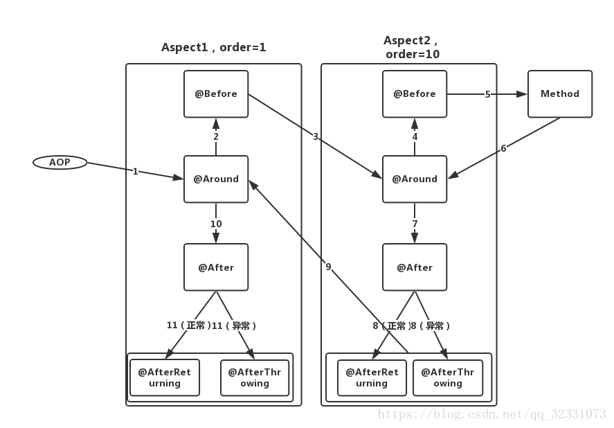

# JAVA面试可能会问的问题

这里只记录我不太会的，和可能出错的。

## Q：基本类型？

A：整数 byte short int long，浮点 float(4字节) double（8字节）， 字符 char（2字节）

还有boolean，单独存在时被试做一个int，boolean数组被视作一个byte数组。


## Q：普通类和抽象类的区别，抽象类里的方法可以具体实现吗。

1. 普通类可以去实例化调用；抽象类不能被实例化，因为它是存在于一种概念而不非具体。

2. 普通类和抽象类都可以被继承，但是抽象类被继承后子类必须重写继承的方法，除非自类也是抽象类。


## Q：抽象类和接口区别

接口所有方法都会公开的

接口成员变量默认为`public static final`，**必须赋初值**，不能被修改；

一个类**可以实现多个接口**，但一个类只能继承一个抽象类。所以，使用接口可以间接地实现多重继承。

接口被用于常用的功能，便于日后维护和添加删除，而抽象类更倾向于充当公共类的角色，


## Q： 线程有几种状态

- 新创建（new 之后）
- 可运行（.start()之后）
- 被终止（自然退出/没有捕获异常退出）
- 被阻塞（试图获取对象内部锁）
- 等待（等待Lock或者Condition）
- 计时等待（Thread.sleep 、带时间限制的等待锁或条件）

java默认有两个线程：主线程和GC线程


## Q：JAVA三大特性

封装（private封装数据， public方法提供访问接口）

继承（继承父类的字段和方法）

多态（同一个方法名，根据不同子类实现不同方法）


## Q：数据库索引知道吗，说一下最左匹配原则。数据库索引底层实现

索引（Index）是帮助MySQL高效获取数据的数据结构。索引用于加快查询速度，一般使用哈希表或者B+树来实现。

索引类型分为主键索引（`primary key( )`）和二级索引（非主键索引`key( )`）

InnoDB使用的是聚簇索引，将**主键组织到一棵B+树**中，而**行数据就储存在叶子节点**上。

而二级索引树中，叶子结点保存着索引值和主键值。

MyISM使用的是非聚簇索引。


聚簇索引相比非聚簇索引的好处：

1. 缓存命中
2. **移动行时无须更新辅助索引中的这个"指针"**


最左匹配原则都是针对**联合索引**来说的。数据库依据联合索引最左的字段来构建B+树。所以查询的时候要把左边的字段判断放在左边。


## Q：平时写sql语句的时候如何查看sql语句执行效率。

explain SQL 命令来查看性能分析。

## Q：数据库事务四大特性，以及四个隔离级别。

如果一个数据库声称支持事务的操作，那么该数据库必须要具备以下四个特性（ACID）：

### ⑴ 原子性（Atomicity）

　　原子性是指事务包含的所有操作要么全部成功，要么全部失败回滚，这和前面两篇博客介绍事务的功能是一样的概念，因此事务的操作如果成功就必须要完全应用到数据库，如果操作失败则不能对数据库有任何影响。

### ⑵ 一致性（Consistency）

　　一致性是指事务必须使数据库从一个一致性状态变换到另一个一致性状态，也就是说一个事务执行之前和执行之后都必须处于一致性状态。

　　拿转账来说，假设用户A和用户B两者的钱加起来一共是5000，那么不管A和B之间如何转账，转几次账，事务结束后两个用户的钱相加起来应该还得是5000，这就是事务的一致性。

### ⑶ 隔离性（Isolation）

　　隔离性是当多个用户并发访问数据库时，比如操作同一张表时，数据库为每一个用户开启的事务，不能被其他事务的操作所干扰，多个并发事务之间要相互隔离。

　　即要达到这么一种效果：对于任意两个并发的事务T1和T2，在事务T1看来，T2要么在T1开始之前就已经结束，要么在T1结束之后才开始，这样每个事务都感觉不到有其他事务在并发地执行。

　　关于事务的隔离性数据库提供了多种隔离级别，稍后会介绍到。

### ⑷ 持久性（Durability）

　　持久性是指一个事务一旦被提交了，那么对数据库中的数据的改变就是永久性的，即便是在数据库系统遇到故障的情况下也不会丢失提交事务的操作。


现在来看看MySQL数据库为我们提供的四种隔离级别：

　　① Serializable (串行化)：可避免脏读、不可重复读、幻读的发生。

　　② Repeatable read (可重复读)：可避免脏读、不可重复读的发生。

　　③ Read committed (读已提交)：可避免脏读的发生。

　　④ Read uncommitted (读未提交)：最低级别，任何情况都无法保证。


在MySQL数据库中，支持上面四种隔离级别，默认的为Repeatable read (可重复读)；而在Oracle数据库中，只支持Serializable (串行化)级别和Read committed (读已提交)这两种级别，其中默认的为Read committed级别。

## Q：你知道几种二叉树呢，说一下二叉树的一些特性。

二叉搜索树 - 平衡二叉树 （AVL、RB-tree）


## Q：你知道几种排序算法呢，说一下快排的实现

冒泡排序、插入排序、选择排序

堆排序 快排 归并排序

计数排序、桶排序


## Q：讲一下TCP四次挥手的过程


客户端   ---------------- 服务器

-》 SYN

​     ACK SYN 《--

 --> ACK


​     ---->     FIN 

​		ACK <--------

​			< ------ send final msg

​		FIN <-----------

  ----->  ACK

wait 

## 为什么有TIME_WAIT

因为在第四步的时候，HOST1发送的ACK可能丢失并导致HOST2重新发送FIN消息，TIME_WAIT维护连接状态.


## Q：序列化的底层怎么实现的

ObjectInputStream  ObjectOutputStream


## Q：synchronized的底层怎么实现的

moniterenter moniterexit


## Q：怎么解决项目中超卖的问题

悲观锁

乐观锁（加版本号）

FIFO队列

## Q：如何判断链表有环？

set缓存；快慢指针


## Q：jvm分区

JVM的内存空间主要有5种分区情况：
1. 线程计数器：一块较小的内存空间，每个线程都有自己的线程计数器，用于完成不同线程上下文切换，如果调用的是本地方法，pc寄存器不存储任何信息。
2. 堆区（Heap）：所有线程共享堆空间，主要存放对象实例与数组，new创建的对象内存都在此分配，因为线程共享，所以需要加锁造成new的开销比较大。
3. 栈区（stack）:栈与线程计数器一样，都是线程独有，栈的生命周期与线程的生命周期同步。每一次方法执行时就会同时创建一个栈帧，用于存储局部变量和操作数栈。每一个方法调用到执行完毕就对应着栈桢在栈区入栈到出栈的过程。
4. 本地方法栈：本地方法执行的时候，进入本地方法栈。
5. 方法区：和堆区一样，都是线程共享。存放JVM加载的类型信息，如类型基本信息，常量，方法表等等


## JAVA的GC机制
GC是java中的垃圾收集器，也是不同于C++的一个地方。C++编程人员容易因为忘记或者错误地回收内存而造成程序崩溃，而Java通过GC机制监测对象是否超过作用域，从而达到自动回收内存的目的。

Java GC针对的是JVM中**堆**和**方法区**。

GC的常用算法
GC的依据就是监测对象的“可达”或“不可达”状态，但为了让GC适配不同的平台，所以GC并没有对如何进行回收作十分严格的规定，不同的实现者有不同的算法。主要有以及下三种：

1. 引用计数法。简单但速度很慢。缺陷是：不能处理循环引用的情况。
2. 停止-复制(stop and copy)。效率低，需要的空间大，优点，不会产生碎片。
3. 标记 - 清除算法 (mark and sweep)。速度较快，占用空间少，标记清除后会产生大量的碎片。
综述：新生代基本采用复制算法，老年代采用标记整理算法。CMS采用标记清理。


> Concurrent Mark Sweep。
>
> 看名字就知道，CMS是一款并发、使用标记-清除算法的gc。CMS是针对老年代进行回收的GC。 

Java内存分配和回收机制是：分代分配，分代回收。新生代中，每次垃圾收集时都有大批对象死去，只有少量存活，就选用复制算法，只需要付出少量存活对象的复制成本就可以完成收集。老年代中，其存活率较高、没有额外空间对它进行分配担保，就应该使用“**标记-整理**”或“**标记-清理**”算法进行回收。


## 新生代分为几个区？使用什么算法进行垃圾回收？为什么使用这个算法？

（三）Java GC的分代垃圾回收机制
GC分代回收算法
GC分代的假设：绝大部分对象的生命周期都非常短暂，存活时间短。
“分代回收”（Generational Collection）算法，把Java堆分为新生代和老年代，这样就可以根据各个年代的特点采用适当的收集算法。在新生代中，每次垃圾收集时都发现有大批对象死去，只有少量存活，那就选用复制算法，只需要付出少量存活对象的复制成本就可以完成收集。而老年代中因为对象存活率高、没有额外空间对它进行分配担保，就必须使用“标记-清理”或“标记-整理”算法来进行回收。

GC垃圾回收器会在下面两种情况下启动：
（a）大多数对象会很快变得不可达。
（b）只有很少的由老对象（创建时间较长的对象）指向新生对象的引用。
为强化这一假设，Java虚拟机在物理上划分为两个逻辑内存代——新生代（Young Generation）和老年代（Old Generation）。新生代（Young Generation）: 新生代空间用来保存那些第一次被创建的Java对象，分为三个空间：
（a）一个伊甸园空间（Eden ）
（b）两个幸存者空间（Survivor ）
一共有三个空间，其中包含两个幸存者空间。每个空间的执行顺序如下：
（a）绝大多数刚刚被创建的对象会存放在伊甸园空间。
（b）在伊甸园空间执行了第一次GC之后，存活的对象被移动到其中一个幸存者空间。
（c）此后，在伊甸园空间执行GC之后，存活的对象会被堆积在同一个幸存者空间。
（d）当一个幸存者空间饱和，还在存活的对象会被移动到另一个幸存者空间。之后会清空已经饱和的那个幸存者空间。
（e）在以上的步骤中重复几次依然存活的对象，就会被移动到老年代。
在新生代中，使用“**停止-复制**”算法进行内存清理。绝大多数最新被创建的对象会被分配到这里，由于大部分对象在创建后会很快变得不可到达，所以很多对象被创建在新生代，然后消失。对象从这个区域消失的过程称为“Minor GC” 。
老年代（Old Generation）: 对象没有变得不可达，并且从新生代中存活下来，会被拷贝到这里。其所占用的空间要比新生代多。也正由于其相对较大的空间，发生在老年代上的GC要比新生代少得多。对象如果在年轻代存活了足够长的时间而没有被清理掉（即在几次Young GC后存活了下来），则会被复制到年老代，年老代的空间一般比年轻代大，能存放更多的对象，在年老代上发生的GC次数也比年轻代少。当年老代内存不足时，将执行Major GC，也叫 Full GC。老年代存储的对象比年轻代多得多，而且不乏大对象，对老年代进行内存清理时，如果使用停止-复制算法，则相当低效。一般，老年代用的算法是**标记-整理**算法，即：标记出仍然存活的对象（存在引用的），将所有存活的对象向一端移动，以保证内存的连续。
小结：Java内存分配和回收机制是：分代分配，分代回收。新生代中，每次垃圾收集时都有大批对象死去，只有少量存活，就选用复制算法，只需要付出少量存活对象的复制成本就可以完成收集。老年代中，其存活率较高、没有额外空间对它进行分配担保，就应该使用“标记-整理”或“标记-清理”算法进行回收。


## 求数组的最大子序列和

贪心

for(int n: nums){

cur = max(n, cur+n);

m = max(m,cur)


## https的过程

客户端     ----------      服务器

handshake: ClientHello --》 包含客户端支持的SSL版本、加密方式

《----  handshake: ServerHello 客户端和服务器都可以使用的ssl版本和加密方式

《-----   Handshake: Certificate 发送服务器公钥

《---- Handshake: ServeHelloDone 完成SSL第一次握手

handshake: ClientKeyExchange ---》客户端回应报文，包含使用服务器公钥加密的随机密码串

ChangeCipherSpec                      ---》接下来提醒服务器之后的通信会采用这个随机密码串进行对称加密

Handshake: Finished                   ---》发送Finish，并包含连接至今所有报文的整体校验值。

《------ ChangeCipherSpec       服务器使用私钥解密，得到对称加密的密钥，开始加密传输数据。

《-----Handshake: Finished


## N平方根

牛顿迭代法


## java线程池，其中的参数代表什么，超过核心size怎么处理，队列满怎么处理，拒绝策略有哪些，几个不同队列的区别


```java
public ThreadPoolExecutor(int corePoolSize, //核心线程池大小
                          int maximumPoolSize, // 最大线程池大小
                          long keepAliveTime, // 线程最大空闲时间
                          TimeUnit unit, // 上一个参数的单位
                          // 等待队列实现类（队列的长度决定了能等待的长度）
                          BlockingQueue<Runnable> workQueue, 
                          ThreadFactory threadFactory, // 线程工厂
                          RejectedExecutionHandler handler) // 拒绝策略
```


拒绝策略：

- AbortPolicy 满了就抛异常
- CallerRunsPolicy 满了就让执行当前方法的线程去自己跑。
- DiscardOldestPolicy 满了就从提交的队列里面扔掉一个
- DiscardPolicy 满了忽视提交的任务


一开始线程池只有核心线程数量，

队列有基于数组的有基于链表的。基于数组的必须指定容量，基于链表的话，不指定容量时默认为MAX_VALUE，容易造成OOM


阻塞队列常用于生产者和消费者的场景，生产者是向队列里添加元素的线程，消费者是从队列里取元素的线程。简而言之，阻塞队列是生产者用来存放元素、消费者获取元素的容器。


## springMVC各层作用，和数据库交互用哪个，怎么使用，dao层全称是什么

现在前后端分离，一般就没有View层了。


controller

service

dao / repository

model / pojo /entity


## 项目中如果数据量过大，考虑数据库分表要怎么分


**分库（垂直切开）：**为了解决单台服务器的性能问题，当单台数据库服务器无法支撑当前的数据量时，就需要根据业务逻辑紧密程度把表分成几撮，分别放在不同的数据库服务器中以降低单台服务器的负载。
分库的目的是降低单台服务器负载，切分原则是根据业务紧密程度拆分，缺点是跨数据库无法联表查询。

**分表原因（水平切开）：**当数据量超大的时候，B-Tree索引就无法起作用了。除非是索引覆盖查询，否则数据库服务器需要根据索引扫描的结果回表，查询所有符合条件的记录，如果数据量巨大，这将产生大量随机I/O，随之，数据库的响应时间将大到不可接受的程度。另外，索引维护（磁盘空间、I/O操作）的代价也非常高。

**垂直切分，**即将表按照功能模块、关系密切程度划分出来，部署到不同的库上。例如，我们会建立定义数据库workDB、商品数据库payDB、用户数据库userDB、日志数据库logDB等，分别用于存储项目数据定义表、商品定义表、用户数据表、日志数据表等。

**水平切分，**当一个表中的数据量过大时，我们可以把该表的数据按照某种规则，例如userID散列、按性别、按省，进行划分，然后存储到多个结构相同的表，和不同的库上。例如，我们的userDB中的用户数据表中，每一个表的数据量都很大，就可以把userDB切分为结构相同的多个userDB：part0DB、part1DB等，再将userDB上的用户数据表userTable，切分为很多userTable：userTable0、userTable1等，然后将这些表按照一定的规则存储到多个userDB上。


## spring事务，默认的是哪个

5种隔离级别，七种传播行为


## 原子性 底层实现

CAS

## 写一个单例模式  为什么用双重检测的  不用静态内部类方式

延迟加载


## 线程间状态转换的方法  yield  和 join

让出CPU，暂停当前线程，执行其他线程（包括自己），由CPU决定

threadA.join() 阻塞所在线程，等调用它的线程（threadA）执行完毕。


## SQL having ，group by，order by ，count（）顺序啊使用方法啊

书写顺序 select,  from,  where,  group by,   having,  order by


执行顺序： from XXX ， where CONDITION， group by XX， having XXX,    select PP,  order by PP 


## 反射有什么坏处

破坏封装性，增加GC的压力

比普通代码慢

反射会创建很多匿名类


## JVM有哪些？

**HotSpot VM**


## AOP说一下，有几种？

**1.经典的基于代理的AOP**，继承MethodBeforeAdvice, AfterReturningAdvice 等接口，然后设置bean

**2.@AspectJ注解驱动的切面**

**3.纯POJO切面**：纯粹通过`<aop:config>`来进行配置


实现： 动态代理，CGLIB（生成字节码）


## Servlet规范了解吗？


## BeanFactory和ApplicationContext的关系？

**BeanFactory**是Spring里面最低层的接口，提供了最简单的容器的功能，只提供了实例化对象和拿对象的功能；

**ApplicationContext**应用上下文，继承BeanFactory接口，它是Spring的一各更高级的容器，提供了更多的有用的功能；

1) 国际化（MessageSource）

2) 访问资源，如URL和文件（ResourceLoader）

3) 载入多个（有继承关系）上下文 ，使得每一个上下文都专注于一个特定的层次，比如应用的web层  

4) 消息发送、响应机制（ApplicationEventPublisher）

5) AOP（拦截器）


##  Spring的自动扫描怎么实现的？谁实现的？


## 分布式实现多个应用的Session共享问题？


##  给一个数据库表，ID、score两个字段分别代表学生ID和成绩，写SQL语句求ID=？的学生排第几名？

```sql
set @rank= 0;
SELECT a.log_id,a.log_created,a.count,@rank:=@rank + 1 AS rank_no
FROM (
		SELECT *
		FROM `logs`
		WHERE log_update > "2017-09-01"
		ORDER BY count DESC
      ) a;
```


## MySQL数据库，给一个用户表格，ID、用户名、性别、用户信息…，假设经常对性别字段进行查询，问怎么建立索引？为什么？假设用户名需要是唯一的，问怎么建索引


## 索引是什么概念？有什么作用？


## MySQL里主要有哪些索引结构？哈希索引和B+树索引比较

存储引擎有：`InnoDB`,`MyISAM`,`Memory`,`Merge`,`Archive`,`Federate`,`CSV`,`BLACKHOLE`等。

### 从数据结构角度

1、B+树索引 O(log(n))

2、hash索引：

- 仅仅能满足"=","IN"和"<=>"查询，不能使用范围查询
- 其检索效率非常高，索引的检索可以一次定位，不像B-Tree 索引需要从根节点到枝节点，最后才能访问到页节点这样多次的IO访问，所以 Hash 索引的查询效率要远高于 B-Tree 索引
- 只有Memory存储引擎显示支持hash索引

3、FULLTEXT索引（现在MyISAM和InnoDB引擎都支持了）

4、R-Tree索引（用于对GIS数据类型创建SPATIAL索引）

### 从物理存储角度

1、聚集索引（clustered index）只能有一个。类似于  字典的读音查询

2、非聚集索引（non-clustered index） 类似于 字典的偏旁查询

### 从逻辑角度

1、主键索引：主键索引是一种特殊的唯一索引，不允许有空值

2、普通索引或者单列索引

3、多列索引（复合索引）：复合索引指多个字段上创建的索引，只有在查询条件中使用了创建索引时的第一个字段，索引才会被使用。使用复合索引时遵循最左前缀集合

4、唯一索引或者非唯一索引

5、空间索引：空间索引是对空间数据类型的字段建立的索引，MYSQL中的空间数据类型有4种，分别是GEOMETRY、POINT、LINESTRING、POLYGON。MYSQL使用SPATIAL关键字进行扩展，使得能够用于创建正规索引类型的语法创建空间索引。创建空间索引的列，必须将其声明为NOT NULL，空间索引只能在存储引擎为MYISAM的表中创建


## ConcurrentHashMap讲一讲

两段式hash，先hash到segment段，然后再hash到具体的值。

和HashMap一样，链表超过8转红黑树

## ThreadLocal应用场景

shiro


## Spring Cloud用到什么东西？如何实现负载均衡？服务挂了注册中心怎么判断


## MySQL行锁是否会有死锁的情况


 对于**ＭyISAM**的表锁，主要有以下几点

  （１）共享读锁（S）之间是兼容的，但共享读锁（S）和排他写锁（X）之间，以及排他写锁之间（X）是互斥的，也就是说读和写是串行的。

  （２）在一定条件下，ＭyISAM允许查询和插入并发执行，我们可以利用这一点来解决应用中对同一表和插入的锁争用问题。

  （３）ＭyISAM默认的锁调度机制是写优先，这并不一定适合所有应用，用户可以通过设置LOW_PRIPORITY_UPDATES参数，或在INSERT、UPDATE、DELETE语句中指定LOW_PRIORITY选项来调节读写锁的争用。

  （４）由于表锁的锁定粒度大，读写之间又是串行的，因此，如果更新操作较多，ＭyISAM表可能会出现严重的锁等待，可以考虑采用InnoDB表来减少锁冲突。

 

  对于**InnoDB**表，主要有以下几点

  （１）InnoDB的行销是基于索引实现的，如果不通过索引访问数据，InnoDB会使用表锁。

  （２）InnoDB间隙锁机制，以及InnoDB使用间隙锁的原因。

  （３）在不同的隔离级别下，InnoDB的锁机制和一致性读策略不同。

  （４）ＭySQL的恢复和复制对InnoDB锁机制和一致性读策略也有较大影响。

  （５）锁冲突甚至死锁很难完全避免。

  在了解InnoDB的锁特性后，用户可以通过设计和SQL调整等措施减少锁冲突和死锁，包括：

- 尽量使用较低的隔离级别
- 精心设计索引，并尽量使用索引访问数据，使加锁更精确，从而减少锁冲突的机会。
- 选择合理的事务大小，小事务发生锁冲突的几率也更小。
- 给记录集显示加锁时，最好一次性请求足够级别的锁。比如要修改数据的话，最好直接申请排他锁，而不是先申请共享锁，修改时再请求排他锁，这样容易产生死锁。
- 不同的程序访问一组表时，应尽量约定以相同的顺序访问各表，对一个表而言，尽可能以固定的顺序存取表中的行。这样可以大减少死锁的机会。
- 尽量用相等条件访问数据，这样可以避免间隙锁对并发插入的影响。
- 不要申请超过实际需要的锁级别；除非必须，查询时不要显示加锁。
- 对于一些特定的事务，可以使用表锁来提高处理速度或减少死锁的可能。


## Volatile关键词？是线程安全的吗


## Tomcat集群Session共享问题


## 讲讲springmvc的基础架构


## set底层如何判断重复元素？hashcode

`HashSet<T> 就等于HashTable<T,0>` 


## 有10个文件，每个文件大概有10G，求里面最大的100个数

堆排序(小顶堆)


## CAS，其中出现ABA问题怎么解决

使用带版本号的


## Session和cookie的区别，如果浏览器禁用了cookie怎么解决

在每个url请求和回应中都加上sessionid字段。

## jvm 类加载的全过程每一步做什么，双亲委派

1. JVM预定义的三种类型类加载器：

    - **启动（Bootstrap）类加载器**：是用本地代码实现的类装入器，它负责将 `/lib`下面的类库加载到内存中（比如`rt.jar`）。由于引导类加载器涉及到虚拟机本地实现细节，开发者无法直接获取到启动类加载器的引用，所以不允许直接通过引用进行操作。
    - **标准扩展（Extension）类加载器**：是由 Sun 的 `ExtClassLoader（sun.misc.Launcher$ExtClassLoader）`实现的。它负责将`< Java_Runtime_Home >/lib/ext`或者由系统变量 `java.ext.dir`指定位置中的类库加载到内存中。开发者可以直接使用标准扩展类加载器。
    - **系统（System）类加载器**：是由 Sun 的 `AppClassLoader（sun.misc.Launcher$AppClassLoader）`实现的。它负责将系统类路径（`CLASSPATH`）中指定的类库加载到内存中。开发者可以直接使用系统类加载器。

    除了以上列举的三种类加载器，还有一种比较特殊的类型 — 线程上下文类加载器。

2. 双亲委派机制描述
    某个特定的类加载器在接到加载类的请求时，首先将加载任务委托给父类加载器，**依次递归**，如果父类加载器可以完成类加载任务，就成功返回；只有父类加载器无法完成此加载任务时，才自己去加载。

## 上海和深圳两个集群，他们https加密的公共密钥怎么同步？


## JVM的各种实现方案最好能搞懂


## hashCode知道是干什么的吗？如果要你重写，需要注意哪些点？


## 线程与进程的区别


## 进程线程间的通信方式


## http报文头部是什么，为什么要有版本号，1.0，1.1，2.0的区别，2.0中的多路复用怎么实现会话的串行传输；


## 阻塞队列不用java提供的自己怎么实现，condition和wait不能用；


## kafka


## jvm相关参数


## Set 了解过吗？知道 add（） 会出什么问题吗？


## 如何设计消息队列


## 如何设计redis


## 用户态和内核态，为什么要切换


## LRU,实现LRU用什么数据结构，为什么


## 非递归和递归相比有什么好处


## 手写二叉树的后序遍历非递归


##  创建线程的方式


## 如何保证TCP发送的信息是正确的，且保证其先后顺序不被篡改


## 死锁是什么，处理死锁的方法有哪些


## 切面 

环绕通知实现
在上一节“应用案例分析”中介绍了Before advice的使用方式，而Spring AOP的通知类型有五种，在Spring 框架里分别有对应的注解来代表每一种通知类型，它们分别是：

@Before 对应——>前置通知 [ Before advice ]

@AfterReturning 对应——>正常返回通知 [ After returning advice ]

@AfterThrowing 对应——>异常返回通知 [ After throwing advice ]

@After 对应——>返回通知 [ After (finally) advice ]

@Around 对应——>环绕通知 [ Around advice ]

原文链接：https://blog.csdn.net/u014745069/java/article/details/84887765


#### 各类型通知执行先后顺序

在实际开发中，有时候我们会针对同一个切入点进行多种Aspect包装，比如，可以有一个Aspect管理对一个方法进行日志打印的通知，而另一个Aspect管理对这个方法的一些校验工作。因此，涉及到两类问题：

1、同一个切入点不同通知的执行顺序

2、同一个切入点不同切面的执行顺序

我们在前面的“环绕通知实现”结果中看到，@Around是先于@Before执行的，这就是其中一个问题的引出，即同一个切入点不同通知的执行顺序。来看下面这张图：



@Order注解改变优先级
@order注解可以使用在类或方法上，但是，直接作用于方法上是无法奏效的，目前的使用方法都是通过标记在切面类上，来实现两个切面的优先级。

@Order注解接收一个int类型的参数，这个参数可以是任意整型数值，数值小的，优先级高。

对于使用@Order来改变通知方法执行的优先级，亲测无法生效。也就是说就算你使用@Order注解，让@Before的优先级高于@Around也依然不会得到想要的结果，而且，如果在一个Aspect类中有两个@Before，并使用@Order来分配这两个@Before的优先级依然不会生效。

因此，在实际开发的过程中，应该避免在一个Aspect类中有多个相同的通知类型，否则，就算使用@Order来区分优先级，可能最后的效果也不符预期。

那么，关于@Order注解实现优先级的方式，我个人总结了以下几条经验：

1、在一个Aspect类中不要有多个同种类型的通知，如多个@Before、多个@After；

2、不要在通知方法上使用@Order来区分优先级，要遵循默认的通知方法优先级（同心圆模型）；

3、如果避免不了有相同类型的通知，要区分在不同的Aspect类中，并且通过@Order(1)、@Order(2)、@Order(3)... 来区分Aspect类的优先级，即以切面类作为优先级的区分单元，而不是通知方法；

4、在编写多个通知方法时，应当把实际业务需要与默认通知优先级（同心圆模型）结合编码。


4.队列中消息是允许延迟吗，如果延迟的话怎么保证消息不被重复消费


## 怎么保证缓存和数据库双写一致

最经典的缓存+数据库读写的模式，就是 Cache Aside Pattern。

- 读的时候，先读缓存，缓存没有的话，就读数据库，然后取出数据后放入缓存，同时返回响应。
- 更新的时候，**先更新数据库，然后再删除缓存**。


7.jvm进程所占的虚拟内存和物理内存相差比较大是什么情况（物理内存不足）？ 


## BeanFactory和FactoryBean的区别


先是聊项目，从项目的架构设计到部署流程。


Java反射原理， 注解原理？


## HashMap在什么情况下会扩容，或者有哪些操作会导致扩容？

… 当HashMap中的元素越来越多的时候，hash冲突的几率也就越来越高，因为数组的长度是固定的。所以为了提高查询的效率，就要对HashMap的数组进行扩容，数组扩容这个操作也会出现在ArrayList中，这是一个常用的操作，而在HashMap数组扩容之后，最消耗性能的点就出现了：原数组中的数据必须重新计算其在新数组中的位置，并放进去，这就是resize。

…那么HashMap什么时候进行扩容呢？当HashMap中的元素个数超过数组大小loadFactor时，就会进行数组扩容，loadFactor的默认值为0.75，这是一个折中的取值。也就是说，默认情况下，数组大小为16，那么当HashMap中元素个数超过16\*0.75=12的时候，就把数组的大小扩展为 2\*16=32，即扩大一倍，然后重新计算每个元素在数组中的位置，扩容是需要进行数组复制的，复制数组是非常消耗性能的操作，所以如果我们已经预知HashMap中元素的个数，那么预设元素的个数能够有效的提高HashMap的性能。


## HashMap检测到hash冲突后，将元素插入在链表的末尾还是开头？


首先要明白什么是hash冲突，不同的key有相同的hash值，这时就会出现hash冲突，发生冲突后，冲突的数据会存在这个Entry对应的链表上（即：Hash冲突后，那么HashMap的单个bucket里存储的不是一个 Entry，而是一个 Entry 链），冲突后会将元素插入在链表的开头。


## Linux怎么查看系统负载情况？

top  load


查询中哪些情况不会使用索引？

数据库索引，底层是怎样实现的，为什么要用B树索引？

Mysql主从同步的实现原理？

谈谈数据库乐观锁与悲观锁？

有使用过哪些NoSQL数据库？MongoDB和Redis适用哪些场景？

描述分布式事务之TCC服务设计？

Redis和memcache有什么区别？Redis为什么比memcache有优势？

考虑redis的时候，有没有考虑容量？大概数据量会有多少？

谈谈分布式锁、以及分布式全局唯一ID的实现比较？

集群监控的时候，重点需要关注哪些技术指标？这些指标如何优化？

从千万的数据到亿级的数据，会面临哪些技术挑战？你的技术解决思路？

最近两年遇到的最大的挫折，从挫折中学到了什么？

最近有没有学习过新技术？